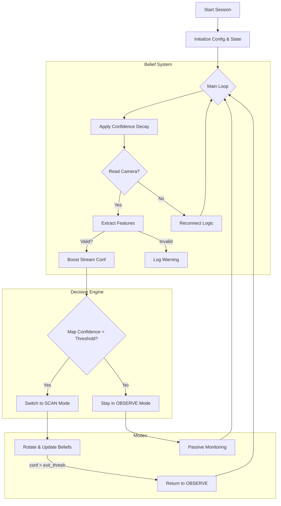

# Wally: Autonomous Surveillance Agent 🤖📹

Wally is an intelligent, autonomous agent designed to monitor an environment using a video feed. It maintains internal "beliefs" about the world state and switches between passive observation and active scanning modes based on confidence levels.

## 🧠 Core Concepts

Wally operates on a **Belief System** driven by two main confidence metrics, modeling **uncertainty** as the inverse of confidence.

### 1. Uncertainty & Belief Modeling
The system models uncertainty heuristically rather than probabilistically. It uses two scalar values to represent the agent's current "trust" in its state:

*   **Stream Confidence (`stream_conf`)**:
    *   *Concept*: Represents the reliability of the visual sensor data.
    *   *Logic*: Increases with every valid frame captured; decays linearly over time.
    *   *Uncertainty*: Low confidence implies high sensor uncertainty, triggering reconnection attempts.

*   **Map Confidence (`map_conf`)**:
    *   *Concept*: Represents the **familiarity** and **stability** of the environment. It models how well the agent's internal representation matches the current observation.
    *   *Logic*: 
        *   **Decays** continuously over time (representing uncertainty growing when unobserved).
        *   **Boosts** when the observed scene matches the agent's stored memory (low feature difference), indicating stability.
        *   **Drops** when the observed scene differs significantly from memory (high feature difference), indicating novelty or change.
    *   *Uncertainty*: Low confidence implies high novelty or uncertainty, triggering an active **Scan** to update the internal model.

### 2. Perception & Visual Features
Wally uses a transient feature extraction system to validate observations before they influence belief:

*   **Sharpness**: Uses Laplacian variance to detect blur.
*   **Structure**: Uses Edge Density (Canny) and Keypoint Density (ORB) to ensure the scene has discernible content.
*   **Novelty**: Uses Mean Absolute Difference (MAD) to detect changes between frames.

Observations deemed "blurry" or "structureless" are discarded and do not boost confidence.

## 🔄 Architecture & Flow

The agent operates in a continuous loop, employing a **hysteresis-based** decision policy to switch modes.



## 📂 Project Structure

*   `main.py`: The brain of the operation. Handles the main loop, state management, and orchestration.
*   `config.py`: Configuration details (RTSP URLs, thresholds, perception params, motor pins).
*   `core/`:
    *   `belief.py`: Mathematical logic for confidence decay/boost and uncertainty modeling.
    *   `decision.py`: Policies for switching between modes.
    *   `camera.py`: Robust camera handling with frame buffering and reconnection logic.
    *   `perception/`:
        *   `features.py`: Visual feature extraction (Sharpness, Edges, ORB Keypoints).
        *   `metrics.py`: Frame difference metrics (MAD).
    *   `actuators/motors.py`: Interface for L298N motor driver control.
*   `modes/`:
    *   `observe.py`: Logic for the passive observation state.
    *   `scan.py`: State machine for the active scanning process (Rotate -> Pause -> Capture -> Repeat).

## 🚀 Getting Started

### Prerequisites

*   Python 3.9+
*   OpenCV (`cv2`)

### Installation

1.  Clone the repository.
2.  Install dependencies:
    ```bash
    pip install -r requirements.txt
    ```

### Configuration

Edit `config.py` to match your hardware and environment:

```python
# config.py
rtsp_url = "rtsp://192.168.1.10:8554/stream"  # Your camera source

# Uncertainty / Scan Policy
scan_enter_thresh = 0.30  # High Uncertainty -> Start scanning (Map Conf < 30%)
scan_exit_thresh = 0.60   # Low Uncertainty -> Stop scanning (Map Conf > 60%)

# Perception / Feature Quality
sharp_min = 0.10      # Minimum sharpness to accept a frame
edge_min = 0.10       # Minimum edge density
kp_min = 0.05         # Minimum keypoint density
```

### Running the Agent

```bash
python main.py
```

### Manual Controls

Triggers can be sent by creating a file in the run directory (managed by `core/storage.py`), or more simply, the agent looks for a trigger file defined in config as `SCAN_NOW`.

## 🛠 Hardware Setup

Wally is designed to run on devices like a Raspberry Pi with:
*   **Camera**: IP Camera (RTSP) or USB Webcams.
*   **Motors**: DC Motors driven by an L298N driver for 360-degree environment scanning.

---
*Built for the Wall-E project.* 🚀
