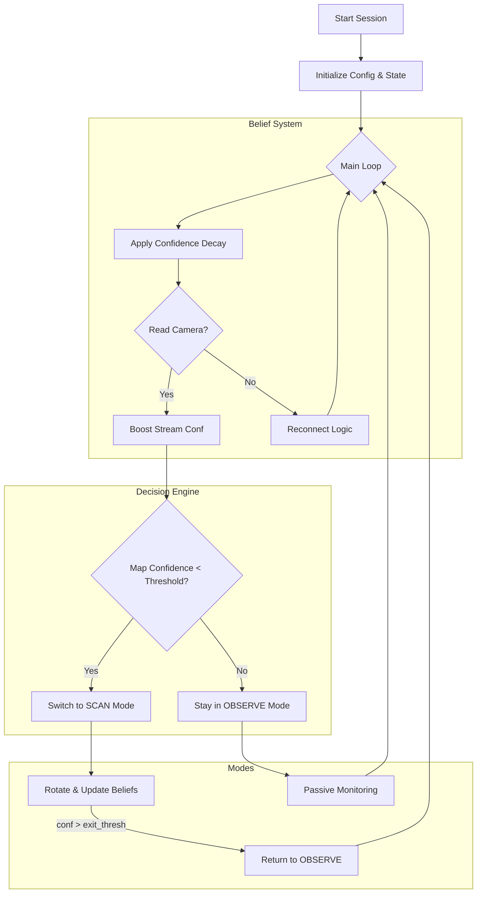

# Wally: Autonomous Surveillance Agent 🤖📹

Wally is an intelligent, autonomous agent designed to monitor an environment using a video feed. It maintains internal "beliefs" about the world state and switches between passive observation and active scanning modes based on confidence levels.

## 🧠 Core Concepts

Wally operates on a **Belief System** driven by two main confidence metrics:

1.  **Stream Confidence (`stream_conf`)**:
    *   *Question*: "Is the camera feed reliable right now?"
    *   *Behavior*: Increases when frames are successfully captured; decays over time.

2.  **Map Confidence (`map_conf`)**:
    *   *Question*: "Is my understanding of the surroundings up-to-date?"
    *   *Behavior*: Decays continuously. When it drops below a threshold, Wally feels "uncertain" and triggers a **Scan**.

## 🔄 Architecture & Flow

The agent operates in a continuous loop, evaluating its state and deciding whether to simply watch or actively investigate.



## 📂 Project Structure

*   `main.py`: The brain of the operation. Handles the main loop, state management, and orchestration.
*   `config.py`: Configuration details (RTSP URLs, thresholds, motor pins).
*   `core/`:
    *   `beliefs.py`: Mathematical logic for confidence decay and boosting.
    *   `decision.py`: Policies for switching between modes.
    *   `camera.py`: Robust camera handling with frame buffering and reconnection logic.
    *   `actuators/motors.py`: Interface for L298N motor driver control.
*   `modes/`:
    *   `observe.py`: Logic for the passive observation state.
    *   `scan.py`: State machine for the active scanning process (Rotate -> Pause -> Capture -> Repeat).

## 🚀 Getting Started

### Prerequisites

*   Python 3.9+
*   OpenCV (`cv2`)

### Installation

1.  Clone the repository.
2.  Install dependencies:
    ```bash
    pip install -r requirements.txt
    ```

### Configuration

Edit `config.py` to match your hardware setup:

```python
# config.py
rtsp_url = "rtsp://192.168.1.10:8554/stream"  # Your camera source

# Scan Policy
scan_enter_thresh = 0.30  # Start scanning when map confidence drops below 30%
scan_exit_thresh = 0.60   # Stop scanning when map confidence recovers to 60%
```

### Running the Agent

```bash
python main.py
```

### Manual Controls

Triggers can be sent by creating a file in the run directory (managed by `core/storage.py`), or more simply, the agent looks for a trigger file defined in config as `SCAN_NOW`.

## 🛠 Hardware Setup

Wally is designed to run on devices like a Raspberry Pi with:
*   **Camera**: IP Camera (RTSP) or USB Webcams.
*   **Motors**: DC Motors driven by an L298N driver for 360-degree environment scanning.

---
*Built for the Wall-E project.* 🚀
